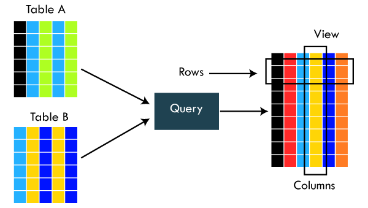

# Aggregate functions, Grouping and Views 👕

## Aggregate Functions

## 🤖 AI Prompt Examples
- Explain aggregate functions with simple examples for beginners.
- Give a real-world example for beginners.


### Count

## 🤖 AI Prompt Examples
- Explain count function with simple examples for beginners.
- Give a real-world example for beginners.


If we want to count how many results we get from a query or a sub-query, we use the COUNT function. This function always returns an integer and it can be used to count all records or distinct records only.

```sql
/* Counts all students */
SELECT COUNT(*)
FROM Students;

/* Counts all students that have a group ( GroupId is not NULL ) */
SELECT COUNT(GroupId)
FROM Students;

/* Counts all students by a unique name ( Students with the same name are all counted as 1 ) */
SELECT COUNT(DISTINCT FirstName)
FROM Students;
```

### Sum

## 🤖 AI Prompt Examples
- Explain sum function with simple examples for beginners.
- Give a real-world example for beginners.


This function returns the sum of all values specified. We can only use this function with numeric columns and can use it for distinct values if we want to. Null values in a column will be ignored in the calculation.

```sql
/* Sums up all the experience of all trainers */
SELECT SUM(YearsExperience)
FROM Trainers;
```

### Min and Max

## 🤖 AI Prompt Examples
- Explain min and max with simple examples for beginners.
- Give a real-world example for beginners.


Min and Max are functions that find the minimum or maximum value out of an expression. These functions can be used with different data types such as numeric, strings, characters, and datetime. These methods return the result of the same datatype as the column it was used on.

```sql
/* Finds the youngest student */
SELECT MIN(Age)  
FROM Students;  
 
/* Finds the oldest student */
SELECT MAX(Age)  
FROM Students;
```

### Average

## 🤖 AI Prompt Examples
- Explain average function with simple examples for beginners.
- Give a real-world example for beginners.


This function finds the average of a given numeric expression. We can also use distinct, to find the average on only the distinct values of a column. The result value can be a different numeric type, depending on what was the type of the column. If we keep integers, it would be int. If we keep decimal, it would be decimal, etc.

```sql
/* Gets the average age of all students */
SELECT AVG(Age)  
FROM Students;  

/* Gets the average age of all students with unique age ( Duplicate age values will count as 1 ) */
SELECT AVG(DISTINCT Age) 
FROM Students;  
```

### String Aggregate

## 🤖 AI Prompt Examples
- Explain string aggregation with simple examples for beginners.
- Give a real-world example for beginners.


If we want to concatenate values from a column, there is a function for that called STRING_AGG. This function concatenates all strings and uses a separator between all the strings or characters. A separator character is not added at the beginning of the end of the concatenated result. The return type is always a string ( VARCHAR or NVARCHAR ) depending on the column datatype. All data types that are not strings or characters are concatenated in a NVARCHAR datatype result.

```sql
/* Creates a string of all names separated by, in a result column called Student Names */
SELECT STRING_AGG (FirstName, ', ') as [Student Names]
FROM Students;
```

## Grouping Functions

## 🤖 AI Prompt Examples
- Explain grouping functions with simple examples for beginners.
- Give a real-world example for beginners.

## 🧪 WORKSHOP 01
- Calculate the total amount on all orders in the system
- Calculate the total amount per BusinessEntity on all orders
- Calculate the total amount per BusinessEntity from Customers with ID < 20
- Find Max Order amount and Avg Order amount per BusinessEntity
- Suggest your own analytical question from Orders

Sometimes when we list results from queries we get a lot of values that are the same per row. We can organize results like these by grouping all the values that are the same.

```sql
/* Groups all students per City and adds the count in a separate column called Students */
SELECT City, COUNT(*) as Students
FROM Students
GROUP BY City;
```

### Filtering by Grouped Data

## 🤖 AI Prompt Examples
- Explain having clause with simple examples for beginners.
- Give a real-world example for beginners.

## 🧪 WORKSHOP 02
- Calculate total amount per BusinessEntity and filter > 635558
- Calculate total amount per BusinessEntity (CustomerId < 20) and filter < 100000
- Find Max and Avg per BusinessEntity and filter where total > 4x average

Filtering can be done after some data is grouped. We can do that with the HAVING statement, by just writing an expression.

```sql
/* Groups all students per City that are not from Skopje and adds the count in a separate column called Students*/
SELECT City, COUNT(*) as Students
FROM Students
GROUP BY City
HAVING City <> 'Skopje'
```

## Views

## 🤖 AI Prompt Examples
- Explain views with simple examples for beginners.
- Give a real-world example for beginners.

## 🧪 WORKSHOP 03
- Create view vv_CustomerOrders (CustomerId + total orders)
- Change to show Customer Names
- Order by highest total price
- Create view vv_EmployeeOrders (Employee + Product + Quantity)
- Filter only region 'Skopski'

Views are virtual tables. This means that a view can be created with data from different existing tables, and act as just another table. A view can be queried just like a normal table. Views can be found in a separate section of the database, on the same level as the tables. It's important to note that even though they are stored as views, the data in them is a combination of data already existing in other tables.



```sql
/* Creates a view with all combinations of students and trainers per group, leaving out trainers or students that do not belong in any group */
CREATE VIEW [Students with a Group and Trainer] AS
SELECT st.FirstName, st.LastName, gr.Name, gr.Academy, tr.FirstName AS Trainer 
FROM Students AS st
JOIN Groups AS gr ON st.GroupId = gr.GroupId
JOIN Trainers AS tr ON tr.GroupId = gr.GroupId;

/* Read the data from the view */
SELECT * FROM [Students with a Group and Trainer];
```

## Homework

- Calculate the count of all grades per Teacher in the system​

- Calculate the count of all grades per Teacher in the system for first 100
Students (ID < 100)​

- Find the Maximal Grade, and the Average Grade per Student on all grades in
the system​

- Calculate the count of all grades per Teacher in the system and filter only
grade count greater then 200​

- Find the Grade Count, Maximal Grade, and the Average Grade per Student on
all grades in the system. Filter only records where Maximal Grade is equal to
Average Grade​

- List Student First Name and Last Name next to the other details from previous
query​

- Create new view (vv_StudentGrades) that will List all StudentIds and count of
Grades per student​

- Change the view to show Student First and Last Names instead of StudentID​

- List all rows from view ordered by biggest Grade Count​

## Extra Materials 📘

  - [Microsoft Documentation](https://docs.microsoft.com/en-us/sql/t-sql/language-reference?view=sql-server-ver15)
  - [Count](https://docs.microsoft.com/en-us/sql/t-sql/functions/count-transact-sql?view=sql-server-ver15)
  - [Sum](https://docs.microsoft.com/en-us/sql/t-sql/functions/sum-transact-sql?view=sql-server-ver15)
  - [Min](https://docs.microsoft.com/en-us/sql/t-sql/functions/min-transact-sql?view=sql-server-ver15)
  - [Max](https://docs.microsoft.com/en-us/sql/t-sql/functions/max-transact-sql?view=sql-server-ver15)
  - [Average](https://docs.microsoft.com/en-us/sql/t-sql/functions/avg-transact-sql?view=sql-server-ver15)
  - [String_Agg](https://docs.microsoft.com/en-us/sql/t-sql/functions/string-agg-transact-sql?view=sql-server-ver15)
  - [Group By](https://docs.microsoft.com/en-us/sql/t-sql/queries/select-group-by-transact-sql?view=sql-server-ver15)
  - [Views](https://docs.microsoft.com/en-us/sql/relational-databases/views/views?view=sql-server-ver15)
  - [Complete Walktrough of Views](https://www.sqlshack.com/sql-view-a-complete-introduction-and-walk-through/)
